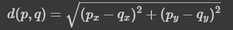

## INSTRUCCIONES


* La evaluación, como toda actividad calificada del curso está sujeta a las reglas del [código de honor del curso](https://progra-fing-usach.github.io/2023_2/honor_code). Cualquier falta a ella será sancionada de acuerdo a los procedimientos que ahí se indican.
* La solución debe desarrollarse directamente en Replit y debe entregarse por CampusVirtual. 
* Durante el período de evaluación el estudiante solo puede resolver dudas de enunciado con el profesor de laboratorio.
* El estudiante solo puede usar Replit y el resumen que la coordinación ha subido en Uvirtual. **El uso de cualquier otro instrumento será calificado con la nota mínima. Esto incluye otros códigos previamente hechos en Replit por el estudiante y apuntes de clase**.
* La evaluación es de carácter individual. Cualquier indicio de intervención de otra persona será calificada con nota mínima a la evaluación.
* La entrega de la solución final debe hacerse en el curso de Campus Virtual en el apartado "LABORATORIO -> CONTROL 1". Antes del fin de la hora.
* Entregas que se realicen por vías distintas a Campus Virtual serán calificadas con nota mínima. En caso de que la plataforma presente un problema, puede enviar su archivo como respaldo al correo de contacto del profesor de Laboratorio, y posteriormente subir el archivo a Campus Virtual.
* La subida del archivo es responsabilidad de su autor, por lo que, archivos que no estén en el formato estipulado, que vengan corruptos o con problemas para ser leídos, no serán revisados. 

## ENTREGA 


Se recibirán soluciones hasta el término del horario de clases en la plataforma Campus Virtual, en el espacio habilitado para ello en la pestaña "LABORATORIO -> CONTROL 1".  
Se requiere entregar un único archivo .py con la solución del problema. Este debe ser exactamente idéntico a su última solución en Replit.

Al inicio del archivo .py, se debe añadir el siguiente encabezado del programa, con los datos solicitados para identificar su trabajo (rellene el encabezado del programa con sus datos personales en formato IDÉNTICO al indicado en el ejemplo del código a continuación): 

```python
# FUNDAMENTOS DE PROGRAMACIÓN PARA INGENIERÍA/FUNDAMENTOS DE COMPUTACIÓN Y PROGRAMACIÓN
# SECCIÓN DEL CURSO: 2-L-1
# PROFESOR DE TEORÍA: FELIPE ROJAS
# PROFESOR DE LABORATORIO: CAMILA RAMIREZ
#
# AUTOR
# NOMBRE: Juan Carlos Pérez González
# RUT: 23.345.432-2
# CARRERA: Ingeniería Civil Mecánica
# <Incluya aquí una breve descripción del programa>

```


Para descargar el archivo, en el proyecto vaya al apartado "Files"


Y descargue el archivo en "Download":


# **PROBLEMA**

La importadora XingXengXongXing cuenta con una flota de embarcaciones para poder movilizar su mercancía entre sus diversos destinos. El problema que tienen es que no saben cuánto tiempo se demorará en llegar cada embarcación a destino. Se cuenta con un archivo .txt donde en la primera línea se tienen las coordenadas del punto de origen, y en la segunda línea se tienen las coordenadas del punto de destino.

Para poder determinar cuánto tiempo se demora una embarcación en llegar a destino se sabe que durante las diferentes estaciones del año ocurre lo siguiente:

- **Verano:** Las condiciones climáticas son óptimas, permitiendo a las embarcaciones avanzar 10 km.
- **Otoño:** Debido a tormentas ocasionales, las embarcaciones solo logran avanzar 1 km durante toda la estación.
- **Invierno:** Tormentas y huracanes impiden el avance. Los fuertes vientos causan un retroceso del 1% de la distancia total recorrida hasta el momento.
- **Primavera:** Con condiciones favorables, las embarcaciones avanzan 20 km.


Para el problema se sabe que:

- Inicio del Viaje: Todas las embarcaciones zarpan al inicio del verano.

- Desplazamiento: El movimiento de las embarcaciones es en línea recta. Para calcular la distancia a recorrer, se debe usar la distancia euclidiana, definida por la ecuación:




Donde p y q son los puntos de origen y destino, respectivamente.

- Unidades de Medida: La distancia entre los puntos está dada en kilómetros.

- Duración del Viaje: Las embarcaciones pueden tardar más de un año en llegar a su destino. En este caso, los patrones climáticos de cada estación se repiten anualmente en orden: Verano, Otoño, Invierno y Primavera. Durando cada uno 3 meses y siempre comenzando en verano.

- Rango de Coordenadas: Tanto para el punto de origen como de destino, las coordenadas (tanto en el eje X como en el eje Y) serán valores entre 0 y 555.

- Momento del Movimiento: Las embarcaciones se mueven una vez que ha concluido cada estación. Por lo que el cálculo de cuánto a recorrido la embarcación solo se hace cuando ha terminado una estación del año.


Cree una función llamada "`calcular`" que reciba un string, con el nombre del archivo con las coordenadas. La función retornar un texto con la cantidad de meses que se demora la embarcación en llegar a destino.
```
def calcular( nombre_archivo_embarcacion ):
  <código_de_la_función_evaluar>
```

## Entrada


 La entrada es el nombre del archivo con el origen y destino de la embarcacion (el nombre del archivo incluye la extensión del archivo). El archivo tiene en la primera línea las coordenadas del punto de origen separadas por coma, siendo la primera correspondiente al eje x y la segunda al eje y. En la siguiente línea se tienen las coordenadas del punto de destino separadas por coma, siendo la primera correspondiente al eje x y la segunda al eje y.

Ejemplo del contenido del archivo de una embarcacion:
```
225,123
540,300
```


## Salida
La función debe retornar un string con la cantidad de meses que se demora en llegar a destino la embarcación con el texto `La embarcación se demora: <cantidad_meses> meses en llegar a destino`

```
La embarcación se demora: 150 meses en llegar a destino
```
## Explicación
A continuación, se muestra un desgloce estación a estación del movimiento de la embarcación para el ejemplo anterior:
```
Distancia total a recorrer: 361.32257056541596

Fin del Verano. Distancia recorrida: 10
Fin del Otoño. Distancia recorrida: 11
Fin del Invierno. Distancia recorrida: 10.89
Fin del Primavera. Distancia recorrida: 30.89
Fin del Verano. Distancia recorrida: 40.89
Fin del Otoño. Distancia recorrida: 41.89
Fin del Invierno. Distancia recorrida: 41.4711
Fin del Primavera. Distancia recorrida: 61.4711
Fin del Verano. Distancia recorrida: 71.4711
Fin del Otoño. Distancia recorrida: 72.4711
Fin del Invierno. Distancia recorrida: 71.74638900000001
Fin del Primavera. Distancia recorrida: 91.74638900000001
Fin del Verano. Distancia recorrida: 101.74638900000001
Fin del Otoño. Distancia recorrida: 102.74638900000001
Fin del Invierno. Distancia recorrida: 101.71892511
Fin del Primavera. Distancia recorrida: 121.71892511
Fin del Verano. Distancia recorrida: 131.71892511
Fin del Otoño. Distancia recorrida: 132.71892511
Fin del Invierno. Distancia recorrida: 131.39173585889998
Fin del Primavera. Distancia recorrida: 151.39173585889998
Fin del Verano. Distancia recorrida: 161.39173585889998
Fin del Otoño. Distancia recorrida: 162.39173585889998
Fin del Invierno. Distancia recorrida: 160.76781850031097
Fin del Primavera. Distancia recorrida: 180.76781850031097
Fin del Verano. Distancia recorrida: 190.76781850031097
Fin del Otoño. Distancia recorrida: 191.76781850031097
Fin del Invierno. Distancia recorrida: 189.85014031530787
Fin del Primavera. Distancia recorrida: 209.85014031530787
Fin del Verano. Distancia recorrida: 219.85014031530787
Fin del Otoño. Distancia recorrida: 220.85014031530787
Fin del Invierno. Distancia recorrida: 218.64163891215478
Fin del Primavera. Distancia recorrida: 238.64163891215478
Fin del Verano. Distancia recorrida: 248.64163891215478
Fin del Otoño. Distancia recorrida: 249.64163891215478
Fin del Invierno. Distancia recorrida: 247.14522252303323
Fin del Primavera. Distancia recorrida: 267.1452225230332
Fin del Verano. Distancia recorrida: 277.1452225230332
Fin del Otoño. Distancia recorrida: 278.1452225230332
Fin del Invierno. Distancia recorrida: 275.3637702978029
Fin del Primavera. Distancia recorrida: 295.3637702978029
Fin del Verano. Distancia recorrida: 305.3637702978029
Fin del Otoño. Distancia recorrida: 306.3637702978029
Fin del Invierno. Distancia recorrida: 303.30013259482485
Fin del Primavera. Distancia recorrida: 323.30013259482485
Fin del Verano. Distancia recorrida: 333.30013259482485
Fin del Otoño. Distancia recorrida: 334.30013259482485
Fin del Invierno. Distancia recorrida: 330.9571312688766
Fin del Primavera. Distancia recorrida: 350.9571312688766
Fin del Verano. Distancia recorrida: 360.9571312688766
Fin del Otoño. Distancia recorrida: 361.9571312688766
La embarcación se demora: 150 meses en llegar a destino
```

## Consideraciones

* Puede y debe probar su función con un bloque principal adecuado, sin embargo, cuando evalúe los test cases, no use ni input ni print.


## Ejemplos
A continuación se muentran ejemplos del contenido de los archivos de entrada y la salida.
### Ejemplo 1

Archivo de Entrada con los datos de la embarcacion:
```
200,200
200,200
```


Salida:
```
La embarcación se demora: 0 meses en llegar a destino
```

### Ejemplo 2

Archivo de Entrada con los datos de la embarcacion:
```
555,555
0,0
```


Salida:
```
La embarcación se demora: 351 meses en llegar a destino
```

  