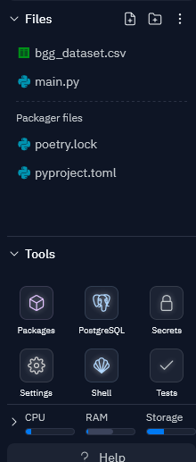
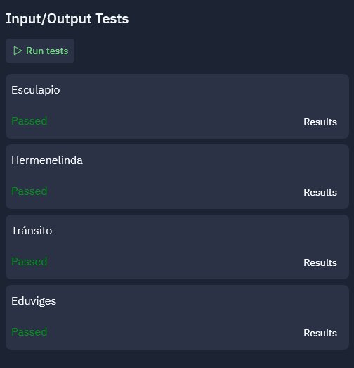
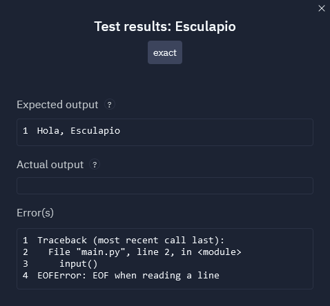

# Hola, mundo

En este proyecto sencillo, el objetivo es familiarizarte con algunas de las herramientas básicas de la plataforma [Replit](https://replit.com/).

Si has llegado hasta aquí, has podido generar un proyecto para que desarrolles siguiendo las instrucciones descritas en un documento como este. Todas las guías y evaluaciones *online* del semestre tendrán un enunciado así, explicando lo que debes hacer, la solución que debes generar, incluyendo una descripción de sus entradas y salidas, consideraciones o restricciones específicas para el problema y algunos ejemplos.

Además, todos los problemas tendrán *testcases*, casos de prueba, los que se pueden acceder con el botón "Tests" de la plataforma, ubicado en la sección "Tools" del menú del lado derecho de la pantalla, como se muestra en la figura 1.


*Figura 1: Ubicación del botón para los testcases*

**Nota:** Al momento de escritura de esta guía, el botón Tests no está disponible en la aplicación móvil de Replit, solo en la versión web.

Para este problema, usaremos los tests más simples, los de entrada y salida (*I/O tests*). El problema consiste en escribir un código que tome como entrada un nombre y entregue como resultado la frase `Hola, <nombre>`, sin hacer ninguna modificación de este nombre. Solo juntar dos strings.

Cuando en un enunciado aparezca un dato entre los símbolos `<` y `>`, como acá, lo que significa es que, desde `<` hasta `>`, debe reemplazarse con el dato que está entre medio, ***ambos símbolos inclusive***. Por ejemplo, si `nombre` fuese "Anacleta", el mensaje debería aparecer como `Hola, Anacleta` y no `Hola, <Anacleta>`.

A continuación, daremos el enunciado del problema:

## Problema

Escriba un programa que reciba un nombre dado por el usuario y engregue como salida el mensaje:
```
Hola, <nombre>
```

El nombre no debe ser modificado (es decir, debe aparecer exactamente como lo escribió el usuario).

## Entradas

La entrada corresponde a un nombre dado por teclado con la siguiente interfaz:
```
<nombre>
```

***Nota que estamos mostrando lo que se verá en la consola cuando ejecutes el programa. En este caso, no usaremos mensajes en el `input`***

## Salida

Un mensaje por pantalla que incluya el nombre:
```
Hola, <nombre>
```

## Cómo usar la plataforma para programar

Una vez escrito el código, el botón "Run", disponible en la parte de arriba de la plataforma (justo sobre este enunciado) ejecutará el código. Prueba a escribir algunas líneas de código y presiona el botón Run para ver lo que ocurre: los resultados aparecerán en la pestaña ">_ Console", que es una consola (intérprete interactivo) de Python, similar a IDLE, el que viene cuando instalas Python en un computador (o sea, puedes probar instrucciones sencillas en esa misma pestaña, como por ejemplo, para ver si algo funciona, antes de escribirlo en tu código).

Cuando veas que tu código funciona y hace lo que se pide (o creas que hace lo que se pide), abre los tests y te aparecerá una pestaña como la Figura 2 en la plataforma.


*Figura 2: Tests para este problema*

Al dar al botón "Run Tests", la plataforma los ejecutará, alimentando al programa con las entradas que se espera que tenga (en este caso, un nombre) y a continuación, verificará que las salidas sean las correctas. Es muy importante poner atención a las instrucciones de cada problema para poder escribir las entradas y salidas correctas y el problema sea bien evaluado.

## Resultados de los tests

Los tests podrán dar como resultado "**Passed**" (pasado) o "**Failed**" (fallado), según si se da el resultado esperado o no, respectivamente, como muestran las figuras 3 y 4.


*Figura 3: Tests fallados*


*Figura 4: Tests pasados*

Al hacer clic en el botón "Results", se puede ver una descripción de por qué no pasaron los tests. Por ejemplo, en la figura 5, el error es causado porque el mensaje de salida no coincide.


*Figura 5: Error de salida. Nótese que en rojo y tachado aparecen los caracteres que sobran y, en verde, lo que debería haber salido. ¡Este sistema incluso cuenta los espacios!*

En este caso, el código que produjo el error es el siguiente:
```python
nombre = input("Ingrese su nombre")
print("Hola,", nombre)
```
Copia el código en la pestaña con el archivo `main.py`, ejecútalo un par de veces, para ver cómo funciona, y corre los tests.

Este código tiene un error, según las instrucciones dadas, pues el mensaje que se le da a `input` es, a efectos de los tests, una **salida**, por lo que, salvo que el enunciado explícitamente señale que debe darse un mensaje, colocar mensajes en `input` es tratado como un error a efectos de la revisión automática de los tests. En este problema particular, no hemos pedido un mensaje para la entrada del usuario, así que ¡no lo incluyas tú!

Otro error bastante frecuente se muestra en la figura 6. Un `EOFError` no te va a ocurrir en tu desarrollo normal en una IDE (como IDLE, VSCode o cuando ejecutas el código con el botón Run), pero en sistemas con pruebas automáticas, puede ocurrir: significa que tu programa puso más `input` de los que debía.


*Figura 6: Error de EOF*

Prueba, por ejemplo, a escribir el siguiente código y correr las pruebas:

```python
nombre = input()
nombre = input()
print("Hola,", nombre)
```

Notarás que, al ver los resultados de los tests, estos muestran el error de la figura 6: ¡los *testcases* de este problema esperan solo un `input` y se toparon con el segundo! Así que ya sabes cómo lidiar con este problema a futuro.

## Ejemplos

Para cada problema de la plataforma, daremos un par de ejemplos, los que podrían o no ser *testcases*, para que sepan qué esperar o qué debería entregar su problema. A continuación, mostraremos dos entradas y las salidas que deberían entregar. Ahora que tienes los ejemplos y un par de códigos que no funcionan, ¡prueba a escribir uno que funcione y resuelva este problema!

### Ejemplo 1
Entrada:
```
Esculapio
```

Salida:
```
Hola, Esculapio
```

### Ejemplo 2
Entrada:
```
Hermenelinda
```

Salida:
```
Hola, Hermenelinda
```
