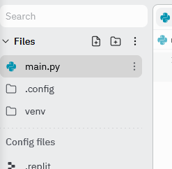

<p></p>


# 10145 - FUNDAMENTOS DE PROGRAMACIÓN PARA INGENIERÍA / 11010 - FUNDAMENTOS DE COMPUTACIÓN Y PROGRAMACIÓN

**Aclaración:** Este es un ejercicio para practicar para la Tarea y por lo tanto no tiene nota. En este caso corresponde al enunciado de la Tarea 1 del primer semestre del 2023. Las intrucciones de entrega presentadas son las que se solicitaron en esa ocasión y son para que se familiarice con ellas antes de la Tarea de este semestre, por lo que no tiene que realizar las acciones de entrega indicadas para este ejercicio, ya que solo es un ejercicio no evaluado.
---------------------------------------------
# TAREA 1 (2023 semestre 1)

## INSTRUCCIONES
---------------------------------------------

* La evaluación, como toda actividad calificada del curso está sujeta a las reglas del [código de honor del curso](https://progra-fing-usach.github.io/2023_1/honor_code). Cualquier falta a ella será sancionada de acuerdo a los procedimientos que ahí se indican.
* La solución debe desarrollarse directamente en Replit y debe entregarse por CampusVirtual. Programe todo su código en la plataforma y verifique que cumple con todos los *testcases* antes de entregar.
* Durante el período de evaluación el estudiante solo puede resolver dudas con el cuerpo docente del curso, es decir, profesores y coordinadores. Consultas a otras personas, como, por ejemplo: tutores, compañeros de su sección u otra, personas que ya rindieron el curso, etc. se considera como un quiebre de esta regla y significará sanción de nota mínima.
* La evaluación es de carácter individual. Cualquier indicio de intervención de otra persona será calificado con nota mínima a la evaluación y quedará impedido de rendir cualquier instancia de evaluación optativa. Adicionalmente deberá rendir las siguientes evaluaciones en forma presencial.
* La entrega de la solución final debe hacerse en el curso de Campus Virtual en el apartado "EVALUACIONES -> TAREA 1".
* Entregas que se realicen por vías distintas a Campus Virtual serán calificadas con nota mínima. En caso de que la plataforma presente un problema, puede enviar su archivo como respaldo al correo de contacto del profesor de Teoría, y posteriormente subir el archivo a Campus Virtual.
* La subida del archivo es responsabilidad de su autor, por lo que, archivos que no estén en el formato estipulado, que vengan corruptos o con problemas para ser leídos, no serán revisados. 

## ENTREGA 
---------------------------------------------

Se recibirán soluciones hasta las **<hora>:<minuto> del <día> de <mes> de 2023** en la plataforma Campus Virtual, en el espacio habilitado para ello en la pestaña "EVALUACIONES -> TAREA 1".  
Se requiere entregar un único archivo .py con la solución del problema. El archivo debe llevar por nombre el RUT de su autor (sin puntos ni guión) por ejemplo: 

19984321K.py

Este debe ser exactamente idéntico a su última solución en Replit.

Al inicio del archivo .py, se debe añadir el siguiente encabezado del programa, con los datos solicitados para identificar su trabajo (rellene el encabezado del programa con sus datos personales en formato IDÉNTICO al indicado en el ejemplo del código a continuación): 


```python
# FUNDAMENTOS DE PROGRAMACIÓN PARA INGENIERÍA/FUNDAMENTOS DE COMPUTACIÓN Y PROGRAMACIÓN
# SECCIÓN DEL CURSO: 2-L-1  
# PROFESOR DE TEORÍA: FELIPE ROJAS  
# PROFESOR DE LABORATORIO: CAMILA RAMIREZ 
#  
# AUTOR  
# NOMBRE: Juan Carlos Pérez González  
# RUT: 23.345.432-2  
# CARRERA: Ingeniería Civil Mecánica  
# <Incluya aquí una breve descripción del programa> 

```


Para descargar el archivo, en el proyecto vaya al apartado "Files":



Y descargue el archivo en "Download":


## **PROBLEMA: LA BOLETA DEL SUPERMERCADO**
---------------------------------------------

### CONTEXTO

Mr. Oso, dueño del OXSO, necesita una solución que le permita calcular rápidamente el total de una boleta y aplicar descuentos a sus clientes según ciertos criterios (Cliente Frecuente, Lunes de Carnes, Martes Vegano, etc.). Sin embargo, los lectores con los que su cajeros escanean los precios, no son necesariamente los mejores y esto le ha traído muchas dificultades, por lo que le han pedido a usted que con su experticia en Python resuelva el problema del supermercado.

### PROBLEMA

Cada vez que los cajeros del OXSO escanean un producto, se ingresa como entrada un string de la forma `'nombre_producto,tipo_producto,precio_unitario_cantidad'`. Donde:
* `nombre_producto` es el nombre del producto comprado.
* `tipo_producto` es la categoría a la que pertenece.
* `precio_unitario` es el valor de una unidad del producto, sin considerar el valor del *impuesto al consumo*.
* `cantidad` es la cantidad de dicho elemento que compra.

Por ejemplo, el string: `'Fruna Carioca,galletas,500,20'`, indicaría que el cliente está comprando 20 galletas Carioca, con un precio sin IVA de $500 cada una.

Una vez que el cajero ha ingresado todos los elementos, escribe `'FIN LECTURA'` en el terminal para pasar a calcular el total de la boleta.

Para esto, en primer lugar se debe calcular el impuesto al consumo de cada producto, el cuál corresponde a un 20% para todos los productos, más un 5% adicional para productos de las categorías `'vinos'`, `'cigarros'`, `'bebidas alcohólicas'` y `'cosas de furros'`. Es decir, los productos de estas cuatro categorías tienen un impuesto de 25%.

Luego de ello, se ingresan los descuentos. En OXSO existen dos formas distintas de descuentos:
* Descuento por tipo de producto: en donde cierto día, un tipo de producto está con un porcentaje de descuento. Por ejemplo: Lunes de carnes, donde todos los productos de la categoría `'carnes'`, están con 10% de descuento.
* Descuento al total de la boleta: en donde se indica la razón del descuento y este se aplica al total de la boleta. Por ejemplo, el programa de amigos de Mr. Oso, otorga un 5% en el total de la compra a personas con el substring `'oso' `en su apellido. 

Para el caso del descuento por tipo de producto, el cajero ingresa el descuento en el formato `'tipo_descuento,tipo_producto,porcentaje_descuento'`, dónde:
* `tipo_descuento`: será siempre en este caso `por producto`.
* `tipo_producto`: corresponde al tipo de producto al que se aplica el descuento.
* `porcentaje`: corresponde al porcentaje de descuento a aplicar.

Por ejemplo: el string `'producto,verduras,10'` estaría generando un 10% de descuento sobre todos los productos de la categoría verduras.  

Para el caso del descuento por total de la boleta, el cajero ingresa el descuento en el formato `'tipo_descuento,motivo,porcentaje_descuento'`, dónde:
* `tipo_descuento`: será siempre en este caso `al total`.
* `motivo`: corresponde al motivo por el cuál se aplicó el descuento (programa de amigos de Mr. Oso, Cliente Frecuente, Cajera/o atendió a un/a amigo/a de toda la vida, etc.).
* `porcentaje`: corresponde al porcentaje de descuento a aplicar.

Por ejemplo: el string `'al total,amiga/o del cajero,10'` estaría generando un 10% de descuento al total de la boleta, porque la/el cajera/o estaba atendiendo a un/a amigo/a. ~~Mr. Oso verá después que hace con ese cajera/o.~~

Una vez ingresados los descuentos, el cajero ingresa `'FIN DESCUENTOS'` y el programa debería calcular y entregar:
* Cuánto se ahorra por cada descuento.
* El valor del total de la boleta con impuestos.
* La cantidad de OSO puntos acumulados, dónde 100 pesos equivale a 1 OSOpunto.

Considere para su solución que el programa deberá validar que las entradas estén correctamente formateadas, es decir:
* Que el string con los productos tenga únicamente 4 campos.
* Que los campos precio unitario y cantidad sean enteros positivos mayores o iguales a 1.
* Que el string con los descuentos tenga únicamente 3 campos.
* Que los descuentos siempre sean un valor entero positivo entre 0 y 99.


En caso de que alguna línea sea ingresada con error debe indicarse el mensaje:
```
Error de ingreso en <producto/descuento>: <N° linea con error>
```
Considerando que siempre se partirá contando desde 1, tanto en productos como en descuentos.


### ENTRADA

Se recibirán tantas líneas con productos como el cliente desee, todas en el formato indicado (aunque podrían tener los errores indicados arriba), hasta que el cajero ingrese `'FIN LECTURA'`.

Luego, se ingresarán tantos descuentos como el cajero desee, todos en el formato indicado (aunque podrían tener los errores indicados arriba), hasta que el cajero ingrese `'FIN DESCUENTOS'`.

En ningún caso las líneas requieren un texto en el `input()` para pedirse. Por ejemplo:

```
Fruna Carioca,galletas,500,20
Monster Zero Blanca,bebidas energeticas,1100,20
Pillows Cereal 1 Kg.,cereales,4700,3
FIN LECTURA
por producto,galletas,3
al total,descuento por gamer,10
al total,descuento por ser amante de las mascotas,5
```

Es una entrada válida, y sin errores.

### SALIDA

*Con el fín de que pueda obtener puntajes parciales el ejercicio se ha dividido en 3 partes. Cada una posee Test específicos para esa etapa del problema. Si usted supera todos los test marcados como Test 10.x obtiene 10 puntos, si supera todos los Test marcados como Test 20.x obtiene 20 puntos y si supera todos los Test marcados con Test 30.x obtiene 30 puntos.*

*Dada las salidas solicitadas en cada uno de los conjuntos de test solo podrá pasar uno de los 3 grupos. Es usted quien decide hasta que punto del problema logró llegar y qué puntaje es al que aspira.*

## Salida de los TEST 10.x (10 pts)
Si las entradas son correctas, se entregará una línea con el ahorro generado por cada descuento en el formato:

`Con el descuento '<motivo/tipo_producto>' te ahorraste $<valor>`

Finalmente, agregar el mensaje `"(TEST 10pts)"`.

Por ejemplo:
```
Con el descuento 'galletas' te ahorraste $100
Con el descuento 'descuento por gamer' te ahorraste $2430
Con el descuento 'descuento por ser amante de las mascotas' te ahorraste $323
(TEST 10pts)
```

## Salida de los TEST 20.x (20 pts)
Si las entradas son correctas, se entregará una línea con el ahorro generado por cada descuento en el formato:

`Con el descuento '<motivo/tipo_producto>' te ahorraste $<valor>`

Luego una línea indicando el total en el formato:
`El total de su boleta es de $<valor>, impuestos incluidos`

Finalmente, agregar el mensaje `"(TEST 20pts)"`.

Por ejemplo:
```
Con el descuento 'galletas' te ahorraste $100
Con el descuento 'descuento por gamer' te ahorraste $2430
Con el descuento 'descuento por ser amante de las mascotas' te ahorraste $323
El total de su boleta es de $35461.3, impuestos incluidos
(TEST 20pts)
```

## Salida de los TEST 30.x (30 pts)
Si las entradas son correctas, se entregará una línea con el ahorro generado por cada descuento en el formato:

`Con el descuento '<motivo/tipo_producto>' te ahorraste $<valor>`

Luego una línea indicando el total en el formato:
`El total de su boleta es de $<valor>, impuestos incluidos`

Para finalizar una línea informando de los OSO puntos acumulados por esta compra:
`Esta compra acumula <total OSOpuntos> oso puntos`

Y una última línea de despedida:
`Gracias, vuelva prontos`

Finalmente, agregar el mensaje `"(TEST 30pts)"`.

Por ejemplo:
```
Con el descuento 'galletas' te ahorraste $100
Con el descuento 'descuento por gamer' te ahorraste $2430
Con el descuento 'descuento por ser amante de las mascotas' te ahorraste $323
El total de su boleta es de $35461.3, impuestos incluidos
Esta compra acumula 354 oso puntos
Gracias, vuelva prontos
(TEST 30pts)
```

En cualquiera de los Test que desee evaluar, si alguna de las entradas fuera incorrecta deberá responder con el texto:
`Error de ingreso en <producto/descuento>: <N° de linea con error>`

Por ejemplo:
```
Error de ingreso en producto: 2
```

En caso de errores, el programa debería informarlos, pero hacer el cálculo de todos modos, ignorando las entradas erróneas.


### RESTRICCIONES
* En caso de errores, el programa deberá informar de todos los que ocurren e ignorarlos para seguir cálculando.
* El cajero puede ingresar descuentos sobre productos que el cliente no ha comprado.

### EJEMPLOS

#### Ejemplo 1
##### Entradas

```
Detergente líquido,Limpieza del hogar,2490,1
Desodorante ambiental,Limpieza del hogar,990,13
Camiseta estampada,Ropa,6990,1
Lomo de cerdo,Carnicería,5990,8
Juguete para gatos,Mascota,990,15
Lápiz labial,Belleza,1490,11
Collar de plata,Accesorios,7990,3
Máscara de pestañas waterproof,Belleza,2490,1
Removedor de manchas,Limpieza del hogar,1490,4
Yogur de arándanos,Lácteos,690,19
Aceite de oliva extra virgen,Conservas,2490,12
Salsa de tomate,Conservas,990,18
Vino blanco,Botillería,4490,19
Pulsera de oro,Accesorios,3990,11
Crema facial Nivea,Belleza,5990,5
Jamonilla,Carnicería,1690,11
Yogur natural,Lácteos,590,5
Cámara de seguridad,Electrónica y Tecnología,59990,12
Collar de oro,Accesorios,4990,20
Chaqueta de cuero,Ropa,24990,13
Carne de vacuno,Carnicería,5490,17
Leche de cabra,Lácteos,2590,14
Tinte para el cabello,Belleza,4490,9
Curry en polvo,Condimentos,1590,18
Arena para roedores,Mascota,2490,19
Servilletas de tela,Limpieza del hogar,1490,18
Yogur griego con frutas,Lácteos,790,9
Falda,Ropa,5990,5
Sardinas en lata,Conservas,990,5
Pantalones de yoga,Ropa,14990,19
Botas,Calzado,34990,10
Limpiador multiusos,Limpieza del hogar,1990,7
Jabón en barra,Limpieza del hogar,690,15
Secadora de pelo,Belleza,44990,17
FIN LECTURA
por producto,Limpieza del hogar,7
al total,Promoción de temporada,7
al total,Descuento por participar en eventos o ferias,2
al total,Descuento por participar en programas de fidelidad,8
FIN DESCUENTOS
```

### SALIDA PARA OBTENER 10 pts
```
Con el descuento 'Limpieza del hogar', te ahorraste $6083.280000000001
Con el descuento 'Promoción de temporada', te ahorraste $273293.21040000004
Con el descuento 'Descuento por participar en eventos o ferias', te ahorraste $72617.910192
Con el descuento 'Descuento por participar en programas de fidelidad', te ahorraste $284662.20795263996
(TEST 10pts)
```

### SALIDA PARA OBTENER 20 pts
```
Con el descuento 'Limpieza del hogar', te ahorraste $6083.280000000001
Con el descuento 'Promoción de temporada', te ahorraste $273293.21040000004
Con el descuento 'Descuento por participar en eventos o ferias', te ahorraste $72617.910192
Con el descuento 'Descuento por participar en programas de fidelidad', te ahorraste $284662.20795263996
El total de su boleta es de $3273615.3914553598, impuestos incluidos
(TEST 20pts)
```

### SALIDA PARA OBTENER 30 pts
```
Con el descuento 'Limpieza del hogar', te ahorraste $6083.280000000001
Con el descuento 'Promoción de temporada', te ahorraste $273293.21040000004
Con el descuento 'Descuento por participar en eventos o ferias', te ahorraste $72617.910192
Con el descuento 'Descuento por participar en programas de fidelidad', te ahorraste $284662.20795263996
El total de su boleta es de $3273615.3914553598, impuestos incluidos
Esta compra acumula 32736 oso puntos
Gracias, vuelva prontos
(TEST 30pts)
```

#### Ejemplo 2

#### Entrada
```
Detergente líquido,Limpieza del hogar,2490,1
Desodorante ambiental,Limpieza del hogar,990,13
Camiseta estampada,Ropa,6990
Lomo de cerdo,Carnicería,5990,8
Juguete para gatos,Mascota,990,15
Lápiz labial,Belleza,1490,11
Collar de plata,Accesorios,7990,3
Máscara de pestañas waterproof,Belleza,2490,1
Removedor de manchas,Limpieza del hogar,1490,4
Yogur de arándanos,Lácteos,690,19
Aceite de oliva extra virgen,Conservas,2490,12
Salsa de tomate,Conservas,990,18
Vino blanco,Botillería,4490,19
Pulsera de oro,Accesorios,3990,-11
Crema facial Nivea,Belleza,5990,5
Jamonilla,Carnicería,1690,11
Yogur natural,Lácteos,590,5
Cámara de seguridad,Electrónica y Tecnología,59990,12
Collar de oro,Accesorios,4990,20
Chaqueta de cuero,Ropa,24990,13
Carne de vacuno,Carnicería,5490,17
Leche de cabra,Lácteos,2590,14
Tinte para el cabello,Belleza,4490,9
Curry en polvo,Condimentos,1590,18
Arena para roedores,Mascota,2490,19
Servilletas de tela,Limpieza del hogar,1490,18
Yogur griego con frutas,Lácteos,790,9
Falda,Ropa,5990,5
Sardinas en lata,Conservas,990,5
Pantalones de yoga,Ropa,14990,19
Botas,Calzado,34990,10
Limpiador multiusos,Limpieza del hogar,1990,7
Jabón en barra,Limpieza del hogar,690,15
Secadora de pelo,Belleza,44990,17
FIN LECTURA
por producto,Limpieza del hogar,107
al total,Promoción de temporada,7
al total,Descuento por participar en eventos o ferias,2
al total,Descuento por participar en programas de fidelidad,8
FIN DESCUENTOS
```

### SALIDA PARA OBTENER 10 pts
```
Error de ingreso en producto: 3
Error de ingreso en producto: 14
Error de ingreso en descuento: 1
Con el descuento 'Promoción de temporada', te ahorraste $269445.12000000005
Con el descuento 'Descuento por participar en eventos o ferias', te ahorraste $71595.4176
Con el descuento 'Descuento por participar en programas de fidelidad', te ahorraste $280654.036992
(TEST 10pts)
```
### SALIDA PARA OBTENER 20 pts
```
Error de ingreso en producto: 3
Error de ingreso en producto: 14
Error de ingreso en descuento: 1
Con el descuento 'Promoción de temporada', te ahorraste $269445.12000000005
Con el descuento 'Descuento por participar en eventos o ferias', te ahorraste $71595.4176
Con el descuento 'Descuento por participar en programas de fidelidad', te ahorraste $280654.036992
El total de su boleta es de $3227521.425408, impuestos incluidos
(TEST 20pts)
```
### SALIDA PARA OBTENER 30 pts
```
Error de ingreso en producto: 3
Error de ingreso en producto: 14
Error de ingreso en descuento: 1
Con el descuento 'Promoción de temporada', te ahorraste $269445.12000000005
Con el descuento 'Descuento por participar en eventos o ferias', te ahorraste $71595.4176
Con el descuento 'Descuento por participar en programas de fidelidad', te ahorraste $280654.036992
El total de su boleta es de $3227521.425408, impuestos incluidos
Esta compra acumula 32275 oso puntos
Gracias, vuelva prontos
(TEST 30pts)
```
