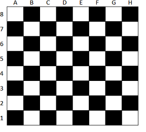

# EL TABLERO DE AJEDREZ

Un profesor de un taller inicial de ajedrez para niños de enseñanza básica debe enseñar a sus estudiantes a familiarizarse con el tablero y con las piezas.

Como muestra la figura 1, el tablero de ajedrez consta de 64 casillas, cada una de las cuales se designa mediante una letra y un número. Por ejemplo, la casilla superior izquierda corresponde a la A8. Este sistema de coordenadas sirve tanto para indicar la posición actual de una pieza como para indicar la posición de destino tras un movimiento.

 
Figura 1: Tablero de ajedrez.

Este juego para dos personas cuenta con piezas blancas (`B`) y negras (`N`), y cada jugador toma un color. Las piezas disponibles para cada jugador al inicio del juego son: 8 peones (`P`), 2 torres (`T`), 2 caballos (`C`), 2 alfiles (`A`), 1 dama o reina (`D`) y 1 rey (`R`).

Como primera tarea, el profesor ha entregado a cada uno de sus estudiantes un conjunto de piezas, indicando para cada una de ellas en qué casilla deben posicionarla.  A fin de poder corregir más fácilmente, Esteban se ha contactado con usted para solicitarle un programa que le ayude a generar las soluciones. 

Así, le ha solicitado un programa que solicite, una a una, las piezas de ajedrez a ubicar en el tablero con su respectiva posición.

Se ingresará un string con datos de la forma: `'<color><pieza><columna><fila>'`,separados por comas. Por ejemplo, el string `'NAA5'` indica que hay un alfil negro en la columna `A`, fila `5`. 
 
 Como resultado, el programa debe mostrar por pantalla una representación del tablero en forma de matriz (respetando el orden de filas y columnas de la Figura 1), donde cada casilla (celda de la matriz) debe contener un string con dos caracteres: dos espacios si dicha casilla está vacía, o la secuencia `'<color><pieza>'` si está ocupada. 
 
 Tenga en cuenta que el usuario solo ingresará valores acordes a las instrucciones (es decir, que no excedan las cantidades máximas de cada tipo y color de pieza, con posiciones dentro del tablero y sin que más de una pieza ocupe una misma casilla.)

## Entrada

Recibirás un único string con cada pieza a ubicar, separadas por comas. Por ejemplo:

```
BCD8,NTA4,NDH3
```

## Salida

Deberás imprimir la lista con el tablero, donde cada elemento debe ir en la posición señalada. Para el caso anterior:
```python
[['  ', '  ', '  ', 'BC', '  ', '  ', '  ', '  '],
 ['  ', '  ', '  ', '  ', '  ', '  ', '  ', '  '],
 ['  ', '  ', '  ', '  ', '  ', '  ', '  ', '  '],
 ['  ', '  ', '  ', '  ', '  ', '  ', '  ', '  '],
 ['NT', '  ', '  ', '  ', '  ', '  ', '  ', '  '],
 ['  ', '  ', '  ', '  ', '  ', '  ', '  ', 'ND'],
 ['  ', '  ', '  ', '  ', '  ', '  ', '  ', '  '],
 ['  ', '  ', '  ', '  ', '  ', '  ', '  ', '  ']] 
```
Basta con que solo imprimas la variable en donde tienes el tablero. No debes preocuparte por el formato de impresión.

## Consideraciones

- Considera que las entradas pueden venir con desde solo una pieza, hasta la totalidad de piezas válidas en el tablero (16).

### Ejemplos

#### Ejemplo 1

Entrada:

```
BCD8,NTA4,NDH3
```

Salida:

```python
[['  ', '  ', '  ', 'BC', '  ', '  ', '  ', '  '], ['  ', '  ', '  ', '  ', '  ', '  ', '  ', '  '], ['  ', '  ', '  ', '  ', '  ', '  ', '  ', '  '], ['  ', '  ', '  ', '  ', '  ', '  ', '  ', '  '], ['NT', '  ', '  ', '  ', '  ', '  ', '  ', '  '], ['  ', '  ', '  ', '  ', '  ', '  ', '  ', 'ND'], ['  ', '  ', '  ', '  ', '  ', '  ', '  ', '  '], ['  ', '  ', '  ', '  ', '  ', '  ', '  ', '  ']]
```

#### Ejemplo 2

Entrada:

```
NTA8,NCB8,NAC8,NRD8,NDE8,NAF8,NCG8,NTH8,NPA7,NPB7,NPC7,NPD7,NPE7,NPF7,NPG7,NPH7,BPA2,BPB2,BPC2,BPD2,BPE2,BPF2,BPG2,BPH2,BTA1,BCB1,BAC1,BDD1,BRE1,BAF1,BCG1,BTH1
```

Salida:

```python
[['NT', 'NC', 'NA', 'NR', 'ND', 'NA', 'NC', 'NT'], ['NP', 'NP', 'NP', 'NP', 'NP', 'NP', 'NP', 'NP'], ['  ', '  ', '  ', '  ', '  ', '  ', '  ', '  '], ['  ', '  ', '  ', '  ', '  ', '  ', '  ', '  '], ['  ', '  ', '  ', '  ', '  ', '  ', '  ', '  '], ['  ', '  ', '  ', '  ', '  ', '  ', '  ', '  '], ['BP', 'BP', 'BP', 'BP', 'BP', 'BP', 'BP', 'BP'], ['BT', 'BC', 'BA', 'BD', 'BR', 'BA', 'BC', 'BT']]
```
